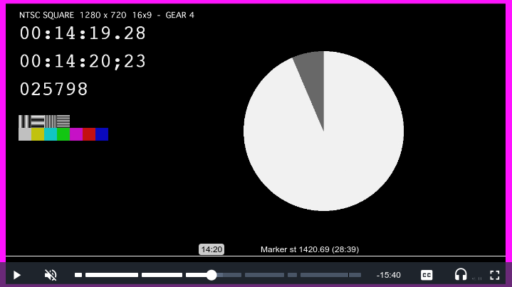

# Cassettator

A collection of video.js components and plugins in a single repo.

⚠️ Still work in progress.

## Table of Contents

- [Cassettator](#cassettator)
  - [Table of Contents](#table-of-contents)
  - [Installation](#installation)
  - [Usage](#usage)
    - [Cassettator-markers](#cassettator-markers)

## Installation

Install cassettator.js via npm:

```bash
npm install cassettator.js
```

## Usage

```javascript
import videojs from 'video.js';
import 'cassettator.js';


const player = videojs('my-player');
```

### Cassettator-markers

A customizable plugin for displaying markers directly in the progress bar.



Refer to the [plugin](docs/cassettator-markers.md) page for more details..
